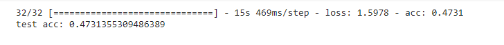

# Architectural Styles Period Classification
-----------------------------------
* [Non-technical slide presentation](https://docs.google.com/presentation/d/1Cdg3Li8UE5px6AfxCg9e_mE-Dwrw06boT6qpo86nIAQ/edit?usp=sharing)
* [Non-technical video presentation](https://drive.google.com/file/d/1iyMhDIILF17g1d4S3gtjz0wOTW9E3i1D/view?usp=sharing)
 
Architectural style classification differs from standard classification tasks due to the richness of inter-class relationships between styles. Because of this, the classification of architectural style is one of the most challenging problems in architectural history. For my Capstone project I have scraped images off the web and combined them with an architectural dataset from Kaggle. To simplify the problem and allow for more images in each class, I have combined classes together into temporal periods.

## Contents of Repository
 * **Images** is a directory containing images used in this README.
 * **Notebooks** is a directory containing the jupyter notebooks used for this project.
     * (1) Data scraping
     * (2) Exploratory Data Analysis & Model Experimentation (performed on Kaggle)
     * (3) Final Modeling (performed on Google colab)
* **Capstone Project Presentation** contains my slide deck for non-technical audiences (also linked in beginning of README)

## Data
The data was gathered in two parts. Part of the data were images I scraped from Google while the other part was obtained from Kaggle. I have combined both and reorganized the files into a new dataset which can be found [by clicking here.](https://www.kaggle.com/gustavoachavez/architectural-styles-periods-dataset) Below is what the distribution of my data was for each class.

## EDA & Data Augmentation
Since images can vary drastically in size, I created a quick dataframe to see what my image sizes and aspect ratios were.

From this you can see that the mean aspect ratio was about 1.3. This means the images in our datset tended to be wider than they were tall in most cases. It can also be noticed that the size of the images present varies greatly as well. Images could had a height dimension from as low as 80 pixels to as big as 5509 pixels. In an attempt to account for this drastic variation in sizes, I decided to make my target input for modeling similar to the mean aspect ratio and also attempted at first to have the input size be near the meadians for height and width. 

### Augmentation
Data Augmentation is a wonderful tool that can help prevent overfitting by generating images distorted to one's specifications and in a way, artificially increasing the amount of training images.

From the above image you can see some of the light distortion that I had made to my data. I played fairly conservative with which distortions I included in my data for I did not want it to become unrecognizable. 

## Modeling
Coding for this project was performed on either Kaggle or Google Colab to take advantage of their GPU usage features and allow for model training to be performed in a reasonable amount of time. Within the notebooks, I have the structure for some of the models that I tried but since Kaggle requires a rerunning of the notebooks to save, I do not have the graphs.

This is the final model I decided to go with of all the models I produced. There are 14 convolutional layers before the dense layers at the end. within this structure, we get to smaller and smaller filter maps before finally allowing the cnn to make a decision. I used an Adam optimizer with a learning rate of 3e-4 as it proved to be faster on correctly converging that SGD. 
## Results

After 10 epochs our model begins showing signs of overfitting with training accuracy continuing to rise and validation accuracy plateauing/decreasing. For that reason, I decided to restart and rerun the model to get this graph.  With this model we are able to get to about ~50% accuracy within 10 epochs.

Within the top-3 features of our model we achieve 80% accuracy. One of the biggest challenges with classifying achitectural styles and periods is how every style is either preceeded or eventually followed by a new and similar style. With this we know that our model is generally in the right ballpark when it makes a prediction on a building.

In this example, we see that the model was able to correctly identify the building as belonging to the modernism period, however we do see that th model had a strong inclination towards Eclecticism as well. Diving deeper into this specific building, the specific style is Art Deco, which actually occurs very early on within the modernist period and is a style who in different sources has been stated to be a part of Eclecticism. Examples like these help elucidate why such a type of classification task proves to be difficult. 

Here we see a better depiction of some of the issues mentioned earlier. The model was able to correctly predict about half of the pictures, however, styles that were misclassified were very likely to be related to each other in some fashion. Early Christian Medieval and Baroque architecture share similar religious influences though they both carry it out differently. While the Renaissance was fueled by a rejection of religion, the start and spread of colonialism began at the same time. The two previously mentioned periods, along with colonialism all share a common building type which is the church. The largest misclassification is the mislabeling of some 21st Century buildings as Modernism. 21st Century is my name for everything that occurs after Modernism and is the architectural period we are currently living in. While it is exploratory in nature with forms, materials, and techniques, there is still a lot of influence from modernism that is expressed in these works and thus both share similarities.

## Conclusion

The model performed with a 47% accuracy on the Top-1 and 80% on the Top-3.  The biggest challenges for the model lie in the complexity and inter-class relationships not just between time periods but within the individual styles.

Moving forward there are many ways to improve on the top-1 accuracy, these range from gathering even more data to considering deepening the network or transfer learning. I hope to continue exploring what can be done and what improvements can be made.

## Acknowledgements

Special thanks to Abhineet Kulkarni, my instructor at [Flatiron School](https://flatironschool.com), for his encouragement, instruction, and guidance.
Special Thanks to my fellow cohort members as well for accompanying me on this journey.

Thanks to [Kaggle](https://www.kaggle.com) for access to data and to Zhe Xu and Kaggle user dumitrux for creating the dataset that served as a base for mine. [link to base](https://www.kaggle.com/dumitrux/architectural-styles-dataset)